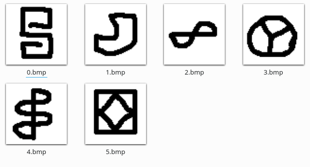

# Ancient Christmas

> As he was walking through the stables, Rudolf found a weird antique wall on
> which a lot of weird symbols we're written. Help him count the symbols to see
> what's behind this wall.
>
> The number of symbols should be written in the same order as here:
>
> *link to attachment*


| Asset        | Note                                                          |
|--------------|---------------------------------------------------------------|
| Author       | Gabies                                                        |
| Category     | PPC                                                           |
| Original URL | `nc challs.xmas.htsp.ro 14001`                                |
| Attachment   | 💾 [Cached][1] 💾 [Google Drive][2]

[1]: ./files
[2]: https://drive.google.com/drive/folders/1MTTRQ0PN1W1r8-MV_1zl5kf6F4uuHCJc

## Analysis

The attached media for this challenge includes a few symbols:



If you notice each symbol represents how separate enclosed areas it contains.
The `0` symbol that looks like an `S` has no contained segments, the `1`
symbol has one, and so on, with the last one having five separate enclosed
shapes.

Upon connecting to the provided netcat server you will be greeted with:

```
Base64 encoded image for challange #1:
b'iVBORw0KGgoAAAANSUhEUgAAAooAAAKKCA ... snip... '
Give me the number of symbols separated by commas (e.g. 0,1,2,3,4,5)
```

Sure enough it contains a base64 encoded image. Sometimes this was a JPEG and
later it was changed to a PNG. The image starts off smaller and each successive
round grows bigger, maxing out around 6000x6000 pixels. You can't just use
`imagemagick` or other basic pixel-matching algorithms because the shape of
each symbol has been warped slightly:


However, armed with the knowledge that each symbol has a specific number of
enclosed loops you can count them despite the warping.

1. Find a black pixel anywhere
2. Floodfill that area, storing any adjacent white
3. Give each adjacent white pixel a unique label
4. Floodfill all the adjacent white areas (limited by bounding box of black
   area), keeping track of which labels touch
5. Merge labels
6. Count unique labels
7. Remove the black pixels flooded in Step 1
